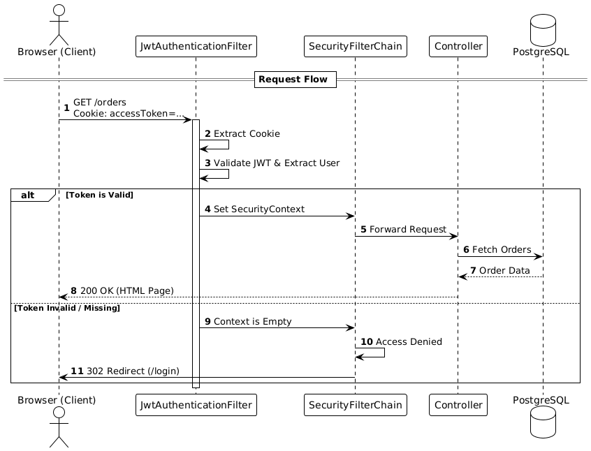
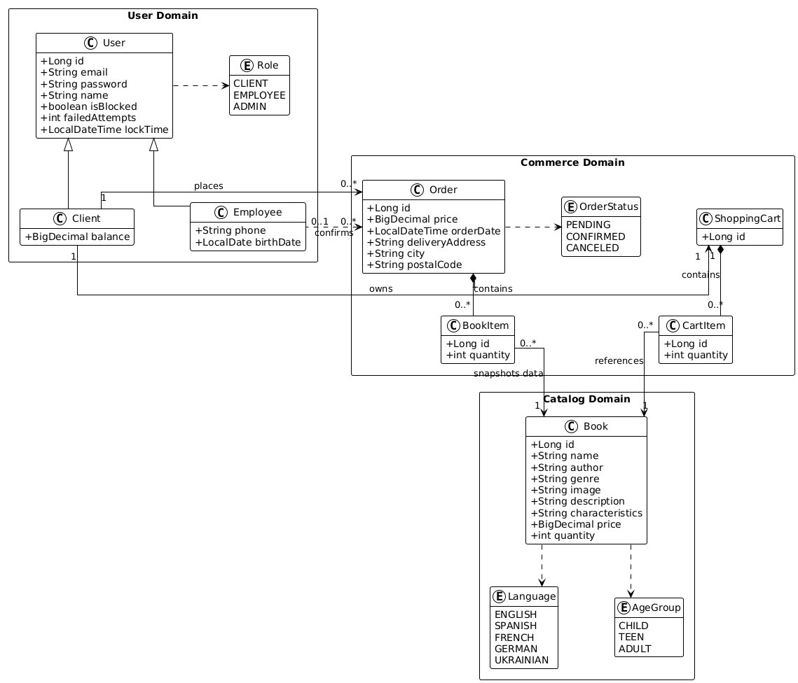

# 📚 Book Store Service

A full-stack Spring Boot application representing a digital book store. This project demonstrates enterprise-level architecture using **Stateless Security (JWT)**, **Dockerized PostgreSQL**, and **Aspect-Oriented Programming (AOP)**.

## 🚀 Features

### 🔐 Security & Authentication
* **Hybrid Stateless/Stateful Architecture:** Authentication: Stateless; User Feedback: Stateful
* **JWT (JSON Web Tokens):** Authentication via tokens stored in **HttpOnly Cookies** (Secured via HTTPS in production).
* **RBAC (Role-Based Access Control):**
    * **Guest:** Browse books, register, login.
    * **Client:** Manage shopping cart, place orders, view order history.
    * **Employee:** Manage book inventory, confirm orders, block/unblock users.
* **Password Encryption:** Strong hashing using `BCryptPasswordEncoder`.

### 📦 Domain Logic
* **Order Management:** Complex business flow: Cart $\to$ Order creation $\to$ Stock validation $\to$ Employee confirmation.
* **Inheritance Mapping:** Uses JPA `InheritanceType.JOINED` to model the `User`, `Client`, and `Employee` hierarchy.
* **DTO Pattern:** Strict separation between Internal Entities and API Data Transfer Objects using `ModelMapper`.

### ⚡ Technical Highlights
* **Containerization:** PostgreSQL database is fully containerized using **Docker Compose**.
* **Performance:** Implements `@EntityGraph` to eliminate the **N+1 Select Problem** during complex data fetching.
* **AOP Logging:** `LoggingAspect` separates cross-cutting concerns (logging, profiling) from business logic.
* **Validation:** Robust input validation using Jakarta Validation (`@Valid`, `@NotNull`).
* **Exception Handling:** Global `@ControllerAdvice` for consistent JSON/HTML error responses.

## 🛠 Technology Stack

* **Java:** 17
* **Framework:** Spring Boot 3.2.1
* **Security:** Spring Security 6 + JJWT (Java JWT)
* **Database:** PostgreSQL 15 + Dockerized (production), H2 (development)
* **Template Engine:** Thymeleaf + Bootstrap 5
* **DevOps:** Docker & Docker Compose
* **Tools:** Lombok, ModelMapper, Maven

## 🏗 Architecture

The project follows a layered MVC architecture:

1.  **Security Layer:** `JwtAuthenticationFilter` intercepts requests, validates HttpOnly cookies, and sets the Security Context.
2.  **Controller Layer:** Handles HTTP requests and maps DTOs.
3.  **Service Layer:** Contains business logic and transactional boundaries (`@Transactional`).
4.  **Repository Layer:** Interacts with the PostgreSQL database using Spring Data JPA.

## Project Diagrams

* **Security Flow Diagram** 
* 
* **Domain Model Diagram**
* 

## 🚀 Quick Start

### Prerequisites
* JDK 17+
* Maven 3.8+
* **Docker & Docker Compose** (Required for the Database)

### Setup

1.  **Clone the repository**
    ```bash
    git clone [https://github.com/murf111/book-store-service.git](https://github.com/your-username/book-store-service.git)
    cd book-store-service
    ```

2.  **Start the Infrastructure**
    The application requires a PostgreSQL container. Start it using Docker Compose:
    ```bash
    docker-compose up -d
    ```
    *This starts PostgreSQL on port `5432`.*

3.  **Configure Application**
    Create your own `.env` using `.env.example`:
    ```properties
    # Database
    DB_HOST=localhost
    DB_PORT=5432
    DB_NAME=bookstore
    DB_USER=admin
    DB_PASSWORD=your_secure_password_here

    # JWT
    JWT_SECRET=generate-your-own-256-bit-secret-key-here
    JWT_EXPIRATION=3600000

    # Email (optional)
    MAIL_HOST=smtp.gmail.com
    MAIL_PORT=587
    MAIL_USERNAME=your-email@gmail.com
    MAIL_PASSWORD=your-app-specific-password
    ```

4.  **Run the App**
    ```bash
    mvn spring-boot:run -Dspring.profiles.active=dev
    mvn spring-boot:run -Dspring.profiles.active=prod   // for prod version (port:8443)
    ```

5.  **Access the Application**
    * **Development (HTTPS):** `https://localhost:8084`
    * **Production (HTTPS):** `https://localhost:8443`
      *(Requires SSL certificate configuration in `application-prod.properties`)*

### Test Login
- **Employee:** john.doe@email.com / password
- **Client:** client1@example.com / password

## 🧪 Testing

The project includes a comprehensive test suite. Integration tests utilize an in-memory H2 database to ensure isolation from the production Docker environment.

```bash
# Run all tests
Unix: export JAVA_HOME=$(/usr/libexec/java_home -v 17) && mvn test
Windows: $env:JAVA_HOME = "C:\Program Files\Java\jdk-17.0.2"; mvn test